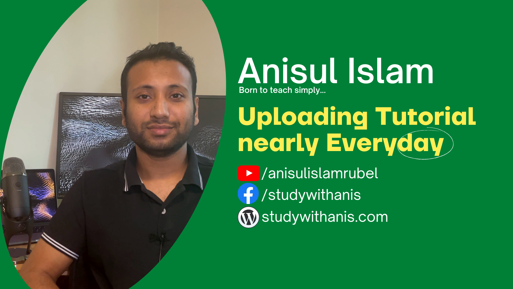
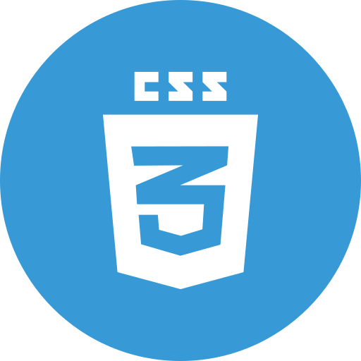
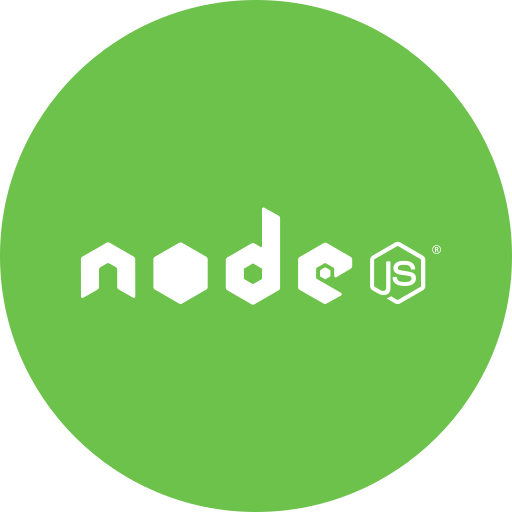
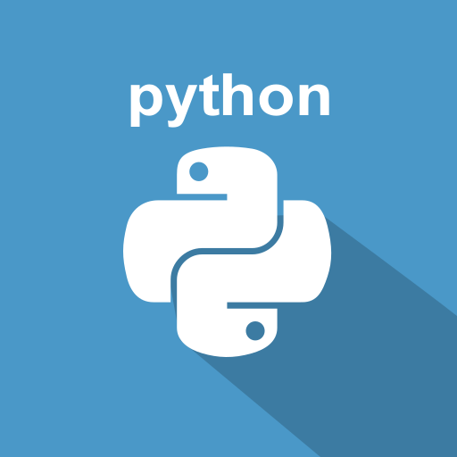

<!-- banner image starts here  -->

<!-- banner image ends here  -->

<h1> 👋 Hello, I'm Anisul Islam </h1>

A full time content creator on & web developer  
🏠 &nbsp; Living: Tampere, Finland

<!-- Contact me section starts here  -->

[][website]
[][youtube]
[][facebook]
[][linkedin]
 
 

<!-- Contact me section ends here  -->

<!-- about-me section starts here  -->

### 👨‍🏫 &nbsp; About Me

I am a passionate computer science teacher. I have been teaching programming languages, web development, and computer science-related subjects to millions of Bangla-speaking students worldwide through my YouTube channel for the last eight years. I had the opportunity to teach thousands of Bachelors's and Higher secondary students at different institutions in Bangladesh. After completing my master's in Software, Web and Cloud in August 2021, I am improving my web development skills. Every day I want to learn something new and share my knowledge with my students and others.

 
<!-- about-me section ends here  -->

<!-- web related skills section starts here  -->

### 👨🏽‍💻 &nbsp; My Skills & Videos:

#### Key Skills & Videos on Web development:

[][htmlplaylist]
[][cssplaylist]
[][bootstrapplaylist]
[][javascriptplaylist]
[][jsonplaylist]
[][sassplaylist]
[][jqueryplaylist]
[][reactplaylist]
[][nodeandexpressplaylist]
[][mongodbplaylist]
[][mysqlplaylist]
[][githubplaylist]

 
 
 

<!-- web related skills section ends here  -->
<!-- other skills and my videos for computer science section starts here  -->

#### Other Skills & Videos:

[][cplaylist]
[][cplusplaylist]
[][javaplaylist]
[][androidplaylist]
[][pythonplaylist]

 
 
 

- [Full-stack web development (Bangla)][fullstackplaylist]
- [Artificial Intelligence (English)][aienglishplaylist]
- [Artificial Intelligence (Bangla)][aibanglaplaylist]
- [Java Swing][javaswingplaylist]
- [Discrte Math][dsplaylist]
- [Numerical Method][numericalplaylist]
- [Theory of computation][tocplaylist]
- [Compiler][compilerplaylist]
- [Networking][networkingplaylist]
- [Operating System][operatingsystemplaylist]
- [HSC ICT][hscictplaylist]
- [Learn for skill][learnforskillplaylist]
- [MS Word][mswordplaylist]
- [MS Excel][msexcelplaylist]
- [MS powerpoint][mspowerpointplaylist]
  <!-- other skills and my videos for computer science section ends here  -->

   

<!-- github stats starts here  -->

<!--  -->

 

<!-- github stats ends here  -->
  <!-- latest youtube videos starts here -->

#### 📹 &nbsp; My Latest YouTube Videos

<!-- YOUTUBE:START -->
- [450k subscribers celebration | megaevent](https://www.youtube.com/watch?v=iMpbfkxX6zE)
- [Congratulatory Videos from subscribers | 450k subscribers](https://www.youtube.com/watch?v=K-nT58yLDJ8)
- [Competitive Programming &amp; overseas Study | Port City International University, Chittagong](https://www.youtube.com/watch?v=xOjCaJ155lg)
- [Football](https://www.youtube.com/watch?v=X86KIRaZndw)
- [Playing badminton](https://www.youtube.com/watch?v=KcvXT8KohRs)
<!-- YOUTUBE:END -->

↪️ &nbsp; [search more videos...](https://www.youtube.com/c/anisulislamrubel)

 

<!-- latest youtube videos ends here -->

<!-- other skills and my videos for computer science section starts here  -->

<!-- work experience section starts here  -->

### 💼 &nbsp; Employment History

| Position            | Institute                                   | Duration            | Location           |
| ------------------- | ------------------------------------------- | ------------------- | ------------------ |
| Full-stack trainer  | Integrify                                   | Aug 2022 - Running  | Helsinki, Finland  |
| Software Engineer   | M-Files                                     | Nov 2021 - Feb 2022 | Tampere, Finland   |
| Research Assistant  | Tampere University                          | Nov 2020 - Jan 2021 | Tampere, Finland   |
| Lecturer of ICT     | Jaflong Valley Boarding School              | Jul 2018 – Nov 2018 | Sylhet, Bangladesh |
| Guest Lecturer      | Sylhet Engineering College                  | Nov 2017 – Apr 2018 | Sylhet, Bangladesh |
| Android developer   | United Computer & Technical Training Center | Nov 2016 – Nov 2017 | Sylhet, Bangladesh |
| Lecturer of ICT     | Zhingabari High School & College            | May 2016 – Aug 2017 | Sylhet, Bangladesh |
| Content Creator     | YouTube                                     | Jan 2012- Running   | USA                |

 
<!-- work experience section ends here  -->
<!-- education section starts here  -->

### 👨🏻‍🎓 &nbsp; Education

1. M.Sc. in Software, Web & Cloud  
   Tampere University  
   Tampere, Finland.
2. B.Sc. in Computer Science & Engineering  
   Leading University  
   Sylhet, Bangladesh.
3. Professional Diploma in Travel & Tourism  
    London School of Commerce & IT  
   London, England.

 

<!-- education section ends here  -->

<!-- my languages section starts here  -->

### Languages:

- 🇧🇩 Bangla : Native
- 🏴󠁧󠁢󠁥󠁮󠁧󠁿 English : Advanced
- 🇮🇳 Hindi : Intermediate
- 🇧🇷 Portugues : Basic
   

<!-- my languages section ends here  -->

<!-- my sports and game section starts here  -->

### Sports / Game / Activities / Hobby:

- 🏏 Cricket, ⚽ Football, 🏸 Badminton, ♟️ Chess, 🏐 Volleyball
- 🏊‍♂️ Swimming, 🏃‍♂️ Running, 🚶‍♂️ Walking
- ✈️ Travelling

 
<!-- my sports and games section ends here  -->

<!-- Honors & awards section starts here  -->

### 🏅 Honors & Awards :

- 100% Scholarship in Masters at Tampere University, Finland
- Silver Button from YouTube (350k subscribers currently)
- Pubali Bank Scholarship of 40,000 BDT for outstanding result in B.Sc.

---

Thanks for going through my Portfolio.
All rights reserved by Anisul Islam @2021

---

<!-- my achievement section ends here  -->

<!-- Links section starts here -->

[website]: http://www.studywithanis.com/
[youtube]: https://www.youtube.com/c/anisulislamrubel
[facebook]: https://www.facebook.com/studywithanis/
[linkedin]: https://www.linkedin.com/in/anisul2020/
[github]: https://github.com/anisul-Islam

<!-- web related playlists starts here  -->
[fullstackplaylist]: https://youtube.com/playlist?list=PLgH5QX0i9K3p06YY1fyReA2UK8mh_zsiY
[htmlplaylist]: https://youtube.com/playlist?list=PLgH5QX0i9K3oHBr5dsumGwjUxByN5Lnw3
[cssplaylist]: https://youtube.com/playlist?list=PLgH5QX0i9K3qjCBXjTmv7Xeh8MDUUVJDO
[bootstrapplaylist]: https://youtube.com/playlist?list=PLgH5QX0i9K3oC_wmWEZa2xWxJauIRQ9kG
[javascriptplaylist]: https://www.youtube.com/playlist?list=PLgH5QX0i9K3qzryglMjcyEktz4q7ySunX
[jsonplaylist]: https://www.youtube.com/playlist?list=PLgH5QX0i9K3rWYYIcCykektDcb_1IPDz4
[sassplaylist]: https://www.youtube.com/playlist?list=PLgH5QX0i9K3qOvGYtFb3Z7KVMLrijYdqO
[jqueryplaylist]: https://www.youtube.com/playlist?list=PLgH5QX0i9K3pSJG9Hwjnykd0hLGEsW4DB
[reactplaylist]: https://youtube.com/playlist?list=PLgH5QX0i9K3rGtitufynBKMy5gAFpa1y8
[nodeandexpressplaylist]: https://www.youtube.com/playlist?list=PLgH5QX0i9K3r6ZGeyFnSv_YDxVON2P85m
[mongodbplaylist]: https://www.youtube.com/playlist?list=PLgH5QX0i9K3r6ZGeyFnSv_YDxVON2P85m
[mysqlplaylist]: https://www.youtube.com/playlist?list=PLgH5QX0i9K3qLcx9DvVDWmNJ7riPvxzCD
[githubplaylist]: https://www.youtube.com/playlist?list=PLgH5QX0i9K3r6ZGeyFnSv_YDxVON2P85m

<!-- web related playlists ends here  -->

<!-- cse related playlists starts here  -->
[cplaylist]: https://youtube.com/playlist?list=PLgH5QX0i9K3pCMBZcul1fta6UivHDbXvz
[cplusplaylist]: https://youtube.com/playlist?list=PLgH5QX0i9K3q0ZKeXtF--CZ0PdH1sSbYL
[javaplaylist]: https://youtube.com/playlist?list=PLgH5QX0i9K3oAZUB2QXR-dZac0c9HNyRa
[androidplaylist]: https://youtube.com/playlist?list=PLgH5QX0i9K3p9xzYLFGdfYliIRBLVDRV5
[pythonplaylist]: https://youtube.com/playlist?list=PLgH5QX0i9K3rz5XqMsTk41_j15_6682BN
[aienglishplaylist]: https://www.youtube.com/playlist?list=PLgH5QX0i9K3rRVV7oeML93OVAxqQ-CvzV
[aibanglaplaylist]: https://youtube.com/playlist?list=PLgH5QX0i9K3oFAaeJxjDWA8kEbMutzV6V
[javaswingplaylist]: https://www.youtube.com/playlist?list=PLgH5QX0i9K3rAHKr6IteF5kdgN6BorH9l
[numericalplaylist]: https://youtube.com/playlist?list=PLgH5QX0i9K3oKFrSOo4Kwns1-vTZmKQ7z
[operatingsystemplaylist]: https://youtube.com/playlist?list=PLgH5QX0i9K3r_SuT0AnOEoElfQQPgkBIq
[dsplaylist]: https://youtube.com/playlist?list=PLgH5QX0i9K3rYy9DVhk28m8enSo8xxiZ3
[tocplaylist]: https://youtube.com/playlist?list=PLgH5QX0i9K3qw5pu16QgnKNj91Rnjoyd0
[compilerplaylist]: https://youtube.com/playlist?list=PLgH5QX0i9K3oWTwTgILA7v9oysoDgkJDg
[networkingplaylist]: https://www.youtube.com/playlist?list=PLgH5QX0i9K3p5OI88r3ob-otmKqIm_DbS
[hscictplaylist]: https://www.youtube.com/playlist?list=PLgH5QX0i9K3o8Y-CKhmyodbfHAc9VSVOv
[learnforskillplaylist]: https://youtube.com/playlist?list=PLgH5QX0i9K3qyJVIaeHSqiRWOyO6HW023
[mswordplaylist]: https://www.youtube.com/playlist?list=PLgH5QX0i9K3p21lsneT3cW4CJL4Bd1lJ2
[mspowerpointplaylist]: https://youtube.com/playlist?list=PLgH5QX0i9K3pBnrckqfJ2zn7FL6Q_LNcm
[msexcelplaylist]: https://www.youtube.com/playlist?list=PLgH5QX0i9K3ohKCQMR7aopneByGX05iSK

<!-- cse related playlists ends here  -->

<!-- Links section ends here -->
